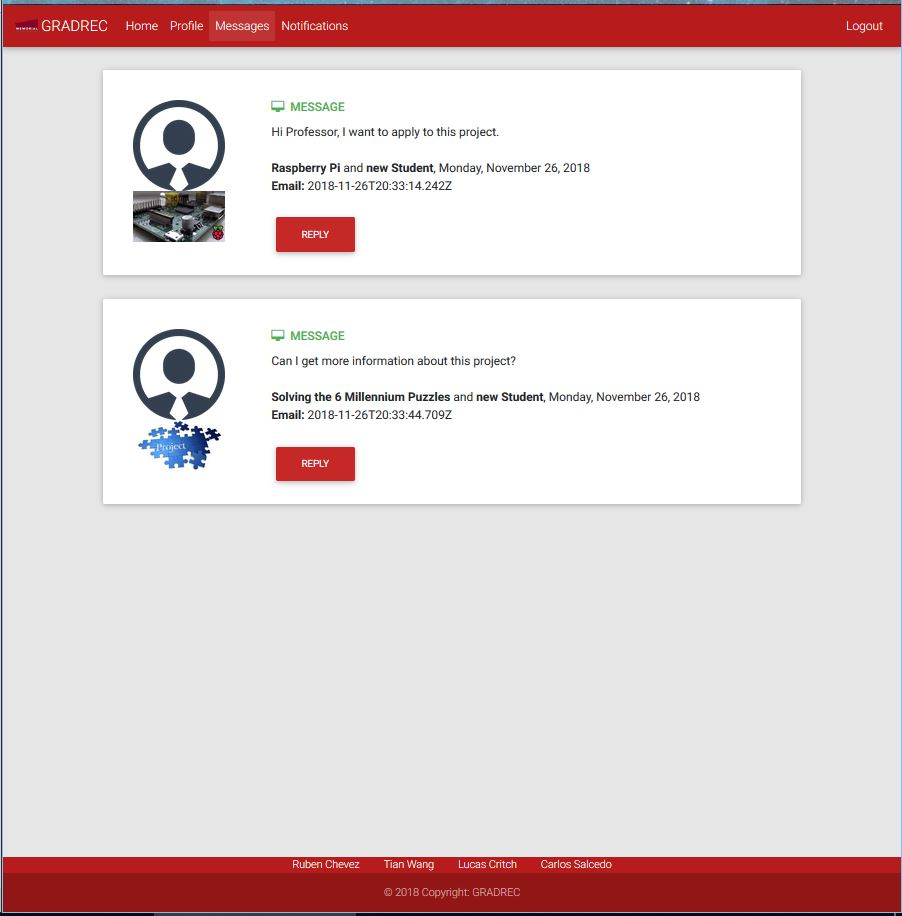
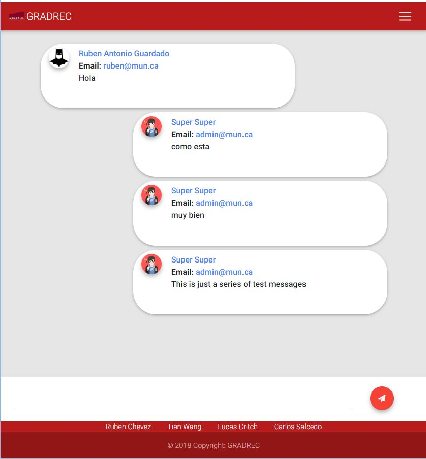

# Messages

Project Managers and students will be able to see their messages from the messages page. This page does not allow new messages to be created, instead, it allows students to continue any message they may have sent from the [Send Message](sendMessage.md) section discussed in the following [link](sendMessage.md). 

From this page, students and project managers will be able to see their different conversations. To view any particular conversation, the user only needs to click on the "reply" button.  

To go back to the index [click here](https://github.com/rubencg195/GRADREC)

# Sample Image - Send Messages Page

 

# Sample Image - Conversation

 
