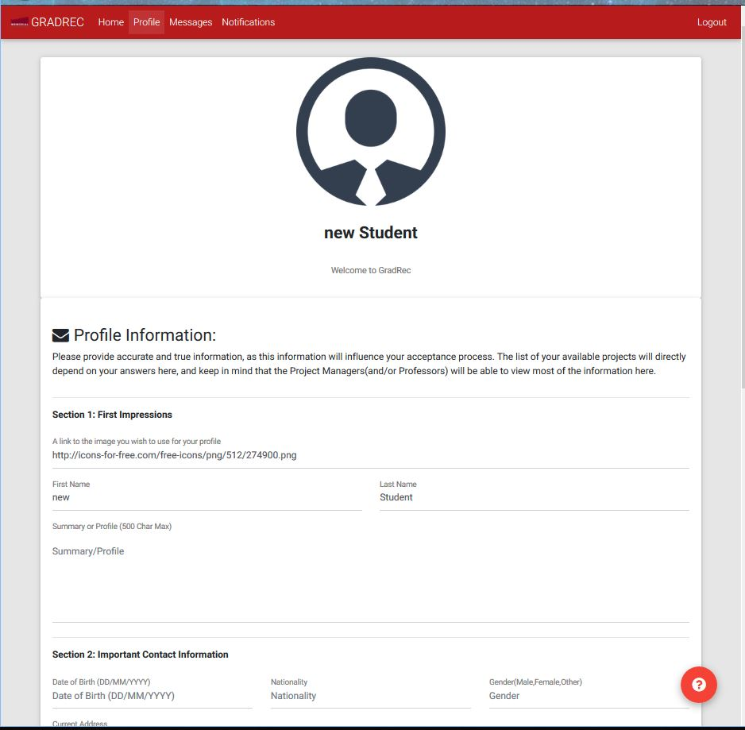

# Create-Edit Profile Page
The profile page is designed for the users to fill out their personal information. In the case of students, the idea is to create a profile that will attract professor and increase their chances of being approved for a project. In the case of Project Managers, some of the information shown here will be displayed along side their projects, so we recommend for project managers to fill out the information in a way that will be appealing for students. Although students will not be able this information directly, some of this information will be displayed.

To go back to the index [click here](https://github.com/rubencg195/GRADREC)

The fields to fill out, are as follows:

### Section 1: First Impressions

The information in this sections is the primary information that will be shared amongst peers, professors, project managers, and any other future stakeholder that may gain access to the page.   

1. A link to the image you wish to use for your profile: Since we do not allow users to upload images, we do allow users to upload their pictures elsewhere, and simply add a link to their image. 
2. First Name: If you have more than one first name (ie a middle name), feel free to add them here, but this is optional. Only the first name should be added here.
3. Last Name: If you have more than one last name, feel free to add them here.
4. Summary or Profile (500 Char Max): The idea of this profile is the same as what you would see in a resume or CV. In a short paragraph, introduce yourself, let us know what you want or wish to accomplish, or what makes you different from the rest.

### Section 2: Important Contact Information

This is your contact information. Please follow the suggested format for the date.

5. Date of Birth
6. Nationality
7. Gender
8. Current Address: Please include the state/province and country. If your address is from a country outside of Canada, please write it down as you would in your native country, so long as it only consists of english characters.  
9. Email
10. Phone Number

### Section 3: Educational Background

As many users of the platform may have multiple titles and degrees, we are only interested in the latest or highest degree obtained, and any other relevant certificates. 

11. Highest Degree Obtained
12. University
13. Other Certificates

### Section 4: Work Experience

We are only interested in the users' last 2 employers, if any.  

14. Last Employer 
15. Job Title
16. Duration
17. Second to Last Employer
18. Job Title
19. Duration

### Section 5: Program Related Information

This information is for students, as it is used to match students to projects. 

20. MSc or PhD: The type of degree the student wishes to pursue.
21. Program: The program in which the student wishes to obtain his title.
22. Skills: Any relevant skills the student may have, that he/she may choose to include. 

### Sample Image

 

To go back to the index [click here](https://github.com/rubencg195/GRADREC)
