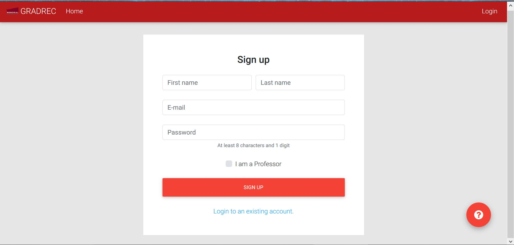

# Register Page
Future users of the platform will have to fill out basic information, before being allowed to log into the system. The register page is fairly simple and self explanatory, containing only 4 fields to be filled out: 1) First Name, 2) Last Name, 3) E-mail Address, and 4) Password. If you are **professor, or project manager**, we recommend you select the check box that says "I am a Professor", as this option will allow you to create and edit new projects.

To go back to the index [click here](https://github.com/rubencg195/GRADREC)

 
