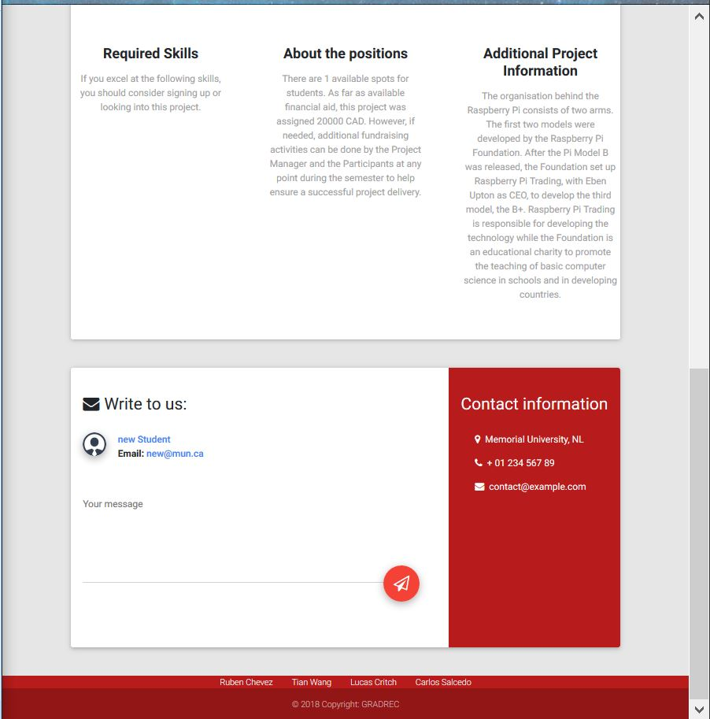

# Send Message -  Apply to Project Option 2

Students are only allowed to innitiate communication with a project manager via the project's page. To access a project's page, the student needs to go to his home page, and click on the project's image. From here, the student is taken to a page displaying the project's information. At the bottom of the page, is a section that allows the student to send a message to the project manager. All th student needs to do, is write a message in the section provided, and click on the paper airplane. 

Additionally, if the student hasn't applied to the project, he/she may also do it from this page. In the beginning, the apply to project option will be available. In the case of Project Manager's, instead of an apply button, they will see an edit project option. 

To go back to the index [click here](https://github.com/rubencg195/GRADREC)

 
