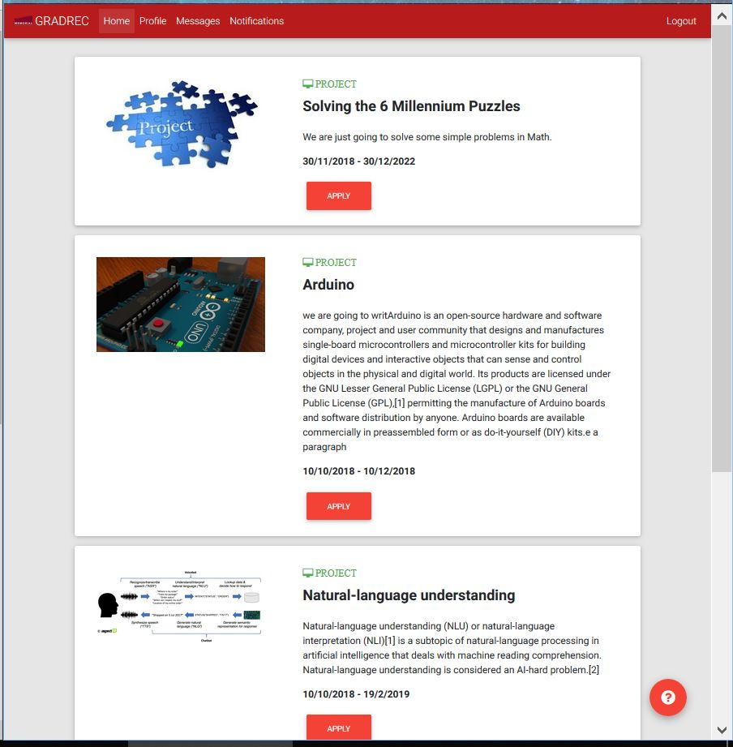
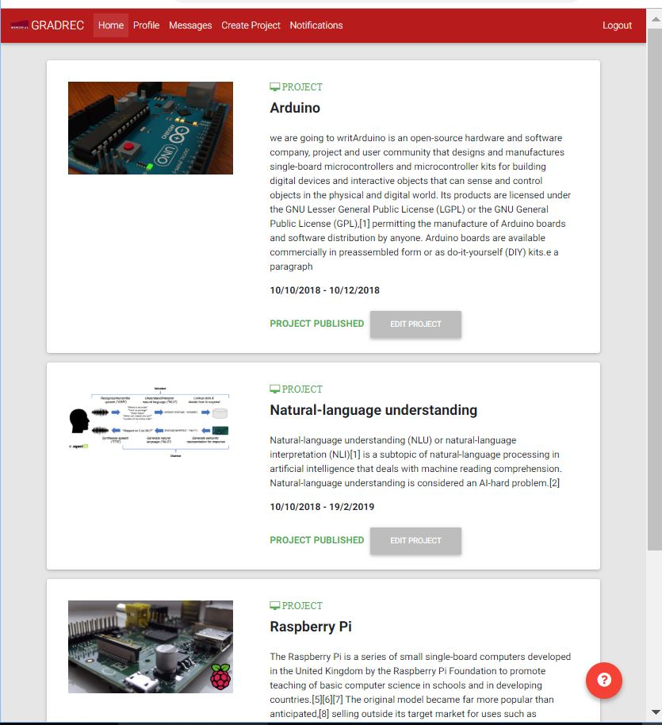

# User Home Page

The student and project manager home pages, or dashboards, are essentially the same, as they both offer the same options. However, ONLY the Project Manager's dashboard includes a **Create Project** option, that allows him to create new projects. Once a user logs into the platform, he's taken into a page displaying various different projects that have been created in GradRec. Both, students and professors, will be able to see the same page, with slight different options.

Project Managers will be able to see within their projects, and "Edit Project" option, while students will only be able to see the "Apply" option. 

To go back to the index [click here](https://github.com/rubencg195/GRADREC)

# Sample Image - Student's View

 

# Sample Image - Project Manager's View

 

